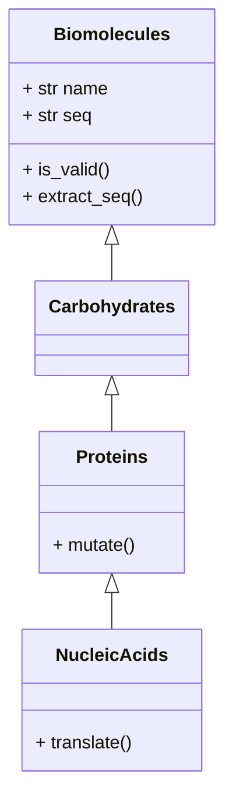

# Objective

## Intro
This is a basic python-focused basic [Object Oriented Programing](https://en.wikipedia.org/wiki/Object-oriented_programming) (OOP) tutorial.

## Background
I have been trying to get a hold of python classes and their inheritance properties for quite some time. I had some intuitons about OOP based on my experiences with several python modules. However, I have never written my own python classes. This repo changes that, *Yay*! 

## Resource(s)

This repo/tutorial is based on my readings of the Chapters 18-21 of John Hunt's book [*A Beginner's Guide to Python 3 Programming*](https://doi.org/10.1007/978-3-030-20290-3_18) published by Springer Nature Switzerland AG. I have been trying to understand OOP from different online resources for quite some time. John Hunt's (this) book seems perfect (at least for me with my current backgrounds)!

# Description

## Motivation

The goal here was to use a biological concept to write custom classes and implement insights discussed in the book chapters. The book's excercises are based on bank account classes. They are great for all audiences. I wanted to try something new and more biology focused! I wanted to both design and implement my classes (not just implement the John Hunt's pre-designed bank-account classes).

## Class design for biomolecules 

### Background
Cell is made of many different types of biomolecules, like:
* Carbohydrates
* Proteins
* Nucleic Acids
* Lipids

Some characterstics are available for each of these biomolecules. Some characterstics are unique. For example, each of these biomolecule types have names, sequences (*e.g.,* nucleottide sequences for nucleic acids, amino acid sequences for proteins, monosaccharide sequences for carbohydrates), molecular weights and so on. As scientists, often, we are interested in some of these aspects - for example, we may be interested in a biomolecules sequence (or a subsequence). When we record these sequences, we may want to make sure that the sequence characters are valid. We would not want to record the sequence `'MASNYREDKGL...'` to be a nucleic acid sequence when clearly it is  a protein sequence (*most likely*)! On the other hand, some operations are type-specific. For example, for nucleotide sequences, we can have a translation operation where the nucleotide sequence will be converted to a protein sequence using the *start codon*, *stop codon* and a reference [codon table](https://en.wikipedia.org/wiki/DNA_and_RNA_codon_tables).

### Design of classes
We are going to use the following insights to design tutorial for biology-inspired OOP tutorial. 

* **Biomolecules**: All biomolecules have names and sequences. 
* **Carbohydrates**: Carbohydrates have names and sequences. 
* **Proteins**: In addition to names and sequences, proteins can be mutated.
* **Nucleic Acids**: In addition to (properties shared with proteins - names, sequences, mutations), nucleic acids can also be translated.

> *Note: Here by carbohydrates I mean polysaccharide chains.* 

> > *Also, based on my preliminary (15-minute) literature survey, it seems that the field of carbohydrate/polysaccharide sequences are not that developed as I initially expected during the class design (Ref: [https://onlinelibrary.wiley.com/doi/10.1002/anie.201803576](https://onlinelibrary.wiley.com/doi/10.1002/anie.201803576)). For simplicity, let's say there are some polysaccharide sequences available and we want to represent them using the Carbohydrate class that we are going to define!*

Our tutorial is based on the aforementioned insights. We will implement a base-class for Biomolecules. Carbohydrates and Proteins classes will inherit from the Biomolecules base-classes. For proteins, we will add a method to mutate protein sequences. Then, we will implement NucleicAcids class by inheriting from the Protein class (this means nucleic acids will also have the capacity to mutate). Finally, NucleicAcids should have the method to translate into a protein sequence. I have not yet implemented the translate feature, it is just shown as a pseudocode.

Following class diagram shows the design of Biomolecules, Carbohydrates, Proteins and Nucleic Acids classes.

## Class Implementation

* Classes are implemented in the script `bio_oop_tutorial.py`.

* Valid characters for carbohydrates, nucleotides, proteins can be provided as lists in the file `data_tables.py`.
* Translate function has not implemented yet. It is written as a pseudocode in the `bio_oop_tutorial.py` script, as of now.